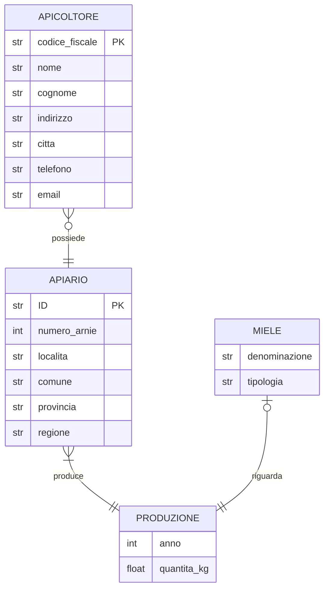

```mermaid
erDiagram

    APICOLTORE {
        str codice_fiscale PK
        str nome
        str cognome
        str indirizzo
        str citta
        str telefono
        str email
    }
    APIARIO {
        str ID PK
        int numero_arnie
        str localita
        str comune
        str provincia
        str regione
    }
    MIELE {
        str denominazione
        str tipologia
    }
    PRODUZIONE {
        int anno
        float quantita_kg
    }

    APICOLTORE }o--|| APIARIO : possiede
    APIARIO }|--|| PRODUZIONE : produce
    MIELE |o--|| PRODUZIONE : riguarda
```